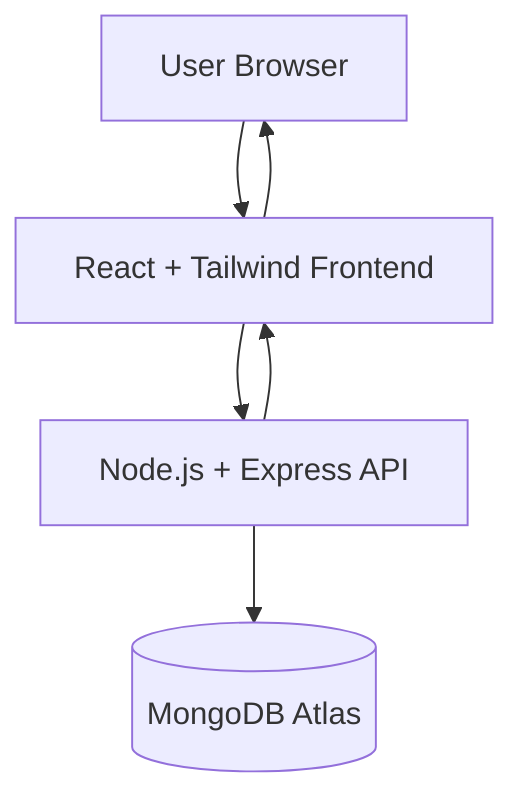

# 🍔 Quick Bite – Food Ordering Web Application


**Quick Bite** is a full-stack **food ordering web application** built using the **MERN Stack (MongoDB, Express.js, React.js, Node.js)**.

The platform allows users to **browse food items, add them to cart, and place orders**, while the backend manages **authentication, order processing, and database operations**.

This project demonstrates **REST API development, full-stack integration, authentication, and responsive UI design**.

---

# 🌐 Live Demo

🔗 Add your deployed link here

Example:

https://quick-bite.vercel.app

---

# ✨ Features

## 👤 User Features

* User registration & login
* Browse available food items
* Add food items to cart
* Remove items from cart
* Place food orders
* Responsive UI for all devices

---

## 🛠️ Backend Features

* RESTful API architecture
* JWT authentication
* Secure password hashing with bcrypt
* MongoDB database integration
* Order management system

---

# 🛠️ Tech Stack

## Frontend

* React.js
* Tailwind CSS
* Axios
* React Router DOM

---

## Backend

* Node.js
* Express.js
* MongoDB
* Mongoose
* JWT Authentication
* bcrypt.js

---

# 🧠 API Endpoints

## Authentication

| Method | Endpoint           | Description   |
| ------ | ------------------ | ------------- |
| POST   | /api/auth/register | Register user |
| POST   | /api/auth/login    | Login user    |

---

## Food Menu

| Method | Endpoint       | Description           |
| ------ | -------------- | --------------------- |
| GET    | /api/foods     | Get all food items    |
| GET    | /api/foods/:id | Get food details      |
| POST   | /api/foods     | Add food item (Admin) |
| PUT    | /api/foods/:id | Update food item      |
| DELETE | /api/foods/:id | Delete food item      |

---

## Cart

| Method | Endpoint      | Description           |
| ------ | ------------- | --------------------- |
| GET    | /api/cart     | Get user cart         |
| POST   | /api/cart     | Add item to cart      |
| DELETE | /api/cart/:id | Remove item from cart |

---

## Orders

| Method | Endpoint         | Description            |
| ------ | ---------------- | ---------------------- |
| POST   | /api/orders      | Place order            |
| GET    | /api/orders/user | Get user orders        |
| GET    | /api/orders      | Get all orders (Admin) |

---

# ⚡ Architecture Diagram



---

# 📂 Project Structure

```id="y7q9q7"
quick-bite
│
├── client
│   ├── components
│   ├── pages
│   ├── context
│   └── App.jsx
│
├── server
│   ├── models
│   ├── routes
│   ├── controllers
│   ├── middleware
│   └── server.js
│
├── screenshots
│
├── .env
└── README.md
```

---

# ⚙️ Installation & Setup

## 1️⃣ Clone Repository

```bash id="nyy41m"
git clone https://github.com/rosymohanty/quick-bite.git
cd quick-bite
```

---

## 2️⃣ Backend Setup

```bash id="w0sl1u"
cd server
npm install
```

Create `.env` file:

```id="e5mmd0"
PORT=5000
MONGO_URI=your_mongodb_connection_string
JWT_SECRET=your_secret_key
```

Run backend:

```bash id="y4n82g"
npm start
```

---

## 3️⃣ Frontend Setup

```bash id="v5xwh7"
cd client
npm install
npm run dev
```

Frontend will run at:

```id="12g0kw"
http://localhost:5173
```

---

# 🌍 Deployment

| Service  | Platform      |
| -------- | ------------- |
| Frontend | Vercel        |
| Backend  | Render        |
| Database | MongoDB Atlas |

---

# 📈 Future Improvements

* Online payment integration
* Order tracking system
* Admin dashboard
* Food category filtering
* Real-time notifications

---

# 👩‍💻 Author

**Rojalin Mohanty**

MCA Student
MERN Stack Developer

GitHub
https://github.com/rosymohanty

---

# ⭐ Support

If you like this project, please give it a **star ⭐ on GitHub**.
